# CrediLinq Agent Architecture & Information Flow Diagram

## System Overview: Hybrid LangGraph + Legacy Architecture

```mermaid
graph TB
    %% Define styles
    classDef langGraphAgent fill:#4a90e2,stroke:#2171b5,stroke-width:2px,color:white
    classDef legacyAgent fill:#f39c12,stroke:#e67e22,stroke-width:2px,color:white
    classDef workflow fill:#27ae60,stroke:#229954,stroke-width:2px,color:white
    classDef database fill:#8e44ad,stroke:#7d3c98,stroke-width:2px,color:white
    classDef api fill:#e74c3c,stroke:#c0392b,stroke-width:2px,color:white
    classDef factory fill:#34495e,stroke:#2c3e50,stroke-width:2px,color:white
    classDef placeholder fill:#95a5a6,stroke:#7f8c8d,stroke-width:1px,color:white

    %% Agent Factory (Central Registry)
    AF[Agent Factory<br/>17 Registered Agents]:::factory

    %% LangGraph Agents (Sophisticated Multi-Step Workflows)
    subgraph LangGraph_Agents ["🚀 LangGraph Agents (17 Active)"]
        PA[PlannerAgent<br/>Strategic Planning]:::langGraphAgent
        RA[ResearcherAgent<br/>Multi-Phase Research]:::langGraphAgent
        WA[WriterAgent<br/>Advanced Content Creation]:::langGraphAgent
        EA[EditorAgent<br/>Multi-Phase Editing]:::langGraphAgent
        SA[SEOAgent<br/>Comprehensive SEO]:::langGraphAgent
        CRA[ContentRepurposerAgent<br/>Multi-Format Adaptation]:::langGraphAgent
        
        IPA[ImagePromptAgent<br/>AI Image Optimization]:::langGraphAgent
        VPA[VideoPromptAgent<br/>Video Content Prompts]:::langGraphAgent
        SMA[SocialMediaAgent<br/>Platform Optimization]:::langGraphAgent
        
        SearchA[SearchAgent<br/>Advanced Web Research]:::langGraphAgent
        CA[ContentAgent<br/>General Content Ops]:::langGraphAgent
        CBA[ContentBriefAgent<br/>Brief Generation]:::langGraphAgent
        DA[DistributionAgent<br/>Multi-Channel Distribution]:::langGraphAgent
        
        DPA[DocumentProcessorAgent<br/>Document Analysis]:::langGraphAgent
        TSA[TaskSchedulerAgent<br/>Advanced Scheduling]:::langGraphAgent
        GAA[GeoAnalysisAgent<br/>GEO Optimization]:::langGraphAgent
        CMA[CampaignManagerAgent<br/>Campaign Orchestration]:::langGraphAgent
    end

    %% Legacy Agents (Simple Implementations)
    subgraph Legacy_Agents ["⚠️ Legacy Agents (6 Active in Workflows)"]
        QRA[QualityReviewAgent<br/>Basic Quality Assessment]:::legacyAgent
        CQA[ContentQualityAgent<br/>Multi-Dimension Quality]:::legacyAgent
        BRA[BrandReviewAgent<br/>Brand Consistency Check]:::legacyAgent
        FAA[FinalApprovalAgent<br/>Approval Decision]:::legacyAgent
        ACGA[AIContentGeneratorAgent<br/>Template Generation]:::legacyAgent
    end

    %% Workflow Orchestrators
    subgraph Workflows ["🔄 Workflow Orchestrators"]
        RWO[ReviewWorkflowOrchestrator<br/>8-Stage Review Process]:::workflow
        CGW[ContentGenerationWorkflow<br/>End-to-End Content Creation]:::workflow
        BWO[BlogWorkflow<br/>Blog Creation Pipeline]:::workflow
        CGWO[ContentGenerationWorkflow<br/>Advanced Content Workflows]:::workflow
        TMS[TaskManagementSystem<br/>Hierarchical Task Coordination]:::workflow
    end

    %% API Layer
    subgraph API_Layer ["🌐 API Layer"]
        RWR[Review Workflow Routes<br/>/api/review]:::api
        CR[Campaign Routes<br/>/api/campaigns]:::api
        BR[Blog Routes<br/>/api/blogs]:::api
        DR[Document Routes<br/>/api/documents]:::api
        SR[Settings Routes<br/>/api/settings]:::api
        WOR[Workflow Orchestration Routes<br/>/api/workflow]:::api
    end

    %% Database Layer
    subgraph Database ["🗄️ Database Layer (PostgreSQL + Vector)"]
        CS[Core Schema<br/>BlogPost, Campaign, Tasks]:::database
        OS[Orchestration Schema<br/>Advanced Workflows]:::database
        AP[Agent Performance<br/>Execution Tracking]:::database
        DC[Document Chunks<br/>RAG Knowledge Base]:::database
        VS[Vector Store<br/>Embeddings & Search]:::database
    end

    %% Frontend
    FE[Frontend React App<br/>User Interface]:::api

    %% Placeholder Agents (Not Connected)
    subgraph Placeholders ["🔳 Placeholder Agents (Inactive)"]
        GEO_PH[GeoAnalysis Placeholder<br/>Future Implementation]:::placeholder
        VR_PH[Visual Review Placeholder<br/>Future Implementation]:::placeholder
        SMR_PH[Social Media Review Placeholder<br/>Future Implementation]:::placeholder
    end

    %% === INFORMATION FLOW CONNECTIONS ===

    %% Agent Factory Registration
    AF -.-> PA
    AF -.-> RA
    AF -.-> WA
    AF -.-> EA
    AF -.-> SA
    AF -.-> CRA
    AF -.-> IPA
    AF -.-> VPA
    AF -.-> SMA
    AF -.-> SearchA
    AF -.-> CA
    AF -.-> CBA
    AF -.-> DA
    AF -.-> DPA
    AF -.-> TSA
    AF -.-> GAA
    AF -.-> CMA

    %% Frontend to API
    FE --> RWR
    FE --> CR
    FE --> BR
    FE --> DR
    FE --> SR
    FE --> WOR

    %% API to Workflows
    RWR --> RWO
    CR --> CMA
    CR --> CGW
    BR --> BWO
    DR --> DPA
    WOR --> TMS

    %% Review Workflow Orchestrator (HYBRID: Uses both Legacy and LangGraph)
    RWO --> CQA
    RWO --> EA
    RWO --> BRA
    RWO --> SA
    RWO --> FAA
    RWO --> GEO_PH
    RWO --> VR_PH
    RWO --> SMR_PH

    %% Content Generation Workflow (Uses Legacy)
    CGW --> QRA
    CGW --> BRA
    CGW --> ACGA

    %% Blog Workflow (Uses LangGraph)
    BWO --> PA
    BWO --> RA
    BWO --> WA
    BWO --> EA
    BWO --> SA

    %% Campaign Manager Orchestration
    CMA --> PA
    CMA --> RA
    CMA --> WA
    CMA --> EA
    CMA --> CRA
    CMA --> TSA
    CMA --> DA

    %% Task Management System
    TMS --> TSA
    TMS --> CMA

    %% Content Pipeline (Core LangGraph Flow)
    PA --> RA
    RA --> WA
    WA --> EA
    EA --> SA
    SA --> CRA

    %% Social Media & Distribution Flow
    CRA --> SMA
    SMA --> DA
    DA --> TSA

    %% Research & Content Brief Flow
    SearchA --> CBA
    CBA --> WA

    %% Document Processing Flow
    DPA --> SearchA
    DPA --> CA

    %% Image & Video Content Flow
    IPA --> CA
    VPA --> CA
    CA --> SMA

    %% GEO Analysis Integration
    GAA --> SA
    SA --> GAA

    %% Database Connections
    PA --> CS
    RA --> CS
    WA --> CS
    EA --> CS
    SA --> CS
    CRA --> CS
    CMA --> OS
    TSA --> OS
    DPA --> DC
    SearchA --> VS
    
    %% Agent Performance Tracking (All agents)
    PA --> AP
    RA --> AP
    WA --> AP
    EA --> AP
    SA --> AP
    CRA --> AP
    IPA --> AP
    VPA --> AP
    SMA --> AP
    SearchA --> AP
    CA --> AP
    CBA --> AP
    DA --> AP
    DPA --> AP
    TSA --> AP
    GAA --> AP
    CMA --> AP
    QRA --> AP
    CQA --> AP
    BRA --> AP
    FAA --> AP
    ACGA --> AP

    %% State Management (LangGraph Agents)
    CS -.-> PA
    CS -.-> RA
    CS -.-> WA
    CS -.-> EA
    CS -.-> SA
    CS -.-> CRA
    CS -.-> CMA
    CS -.-> GAA
```



## Agent Status Summary

### 🚀 **LangGraph Agents (17 Active)**
| Agent | Type | Function | Connections |
|-------|------|----------|-------------|
| PlannerAgent | Core Pipeline | Strategic planning, market analysis | → ResearcherAgent, CampaignManager |
| ResearcherAgent | Core Pipeline | Multi-phase research workflows | → WriterAgent |
| WriterAgent | Core Pipeline | Advanced content creation | → EditorAgent |
| EditorAgent | Core Pipeline | Multi-phase editing workflows | **Used in ReviewWorkflow** |
| SEOAgent | Core Pipeline | Comprehensive SEO optimization | **Used in ReviewWorkflow** |
| ContentRepurposerAgent | Specialized | Multi-format content adaptation | → SocialMediaAgent |
| ImagePromptAgent | Media | AI image prompt optimization | → ContentAgent |
| VideoPromptAgent | Media | Video content prompting | → ContentAgent |
| SocialMediaAgent | Distribution | Platform-specific optimization | ← ContentRepurposer |
| SearchAgent | Research | Advanced web research | → ContentBriefAgent |
| ContentAgent | General | General content operations | ← Image/Video Agents |
| ContentBriefAgent | Planning | Content brief generation | ← SearchAgent |
| DistributionAgent | Distribution | Multi-channel distribution | ← SocialMediaAgent |
| DocumentProcessorAgent | Processing | Document analysis | → SearchAgent |
| TaskSchedulerAgent | Orchestration | Advanced scheduling | ← CampaignManager |
| GeoAnalysisAgent | Optimization | Generative Engine Optimization | ↔ SEOAgent |
| CampaignManagerAgent | Orchestration | Campaign orchestration | → Multiple agents |

### ⚠️ **Legacy Agents (6 Active in Workflows)**
| Agent | Used In | Function | Status |
|-------|---------|----------|---------|
| QualityReviewAgent | ContentGenerationWorkflow | Basic quality assessment | **ACTIVE** |
| ContentQualityAgent | ReviewWorkflowOrchestrator | Multi-dimension quality analysis | **ACTIVE** |
| BrandReviewAgent | Both Workflows | Brand consistency checking | **ACTIVE** |
| FinalApprovalAgent | ReviewWorkflowOrchestrator | Approval decision making | **ACTIVE** |
| AIContentGeneratorAgent | ContentGenerationWorkflow | Template-based generation | **ACTIVE** |

### 🔳 **Placeholder Agents (Inactive)**
- GeoAnalysis Placeholder (in ReviewWorkflow)
- Visual Review Placeholder (in ReviewWorkflow) 
- Social Media Review Placeholder (in ReviewWorkflow)

## Information Flow Patterns

### 1. **Core Content Pipeline (LangGraph)**
```
Planner → Researcher → Writer → Editor → SEO → ContentRepurposer
```

### 2. **Review Workflow (Hybrid)**
```
Content → ContentQuality(Legacy) → Editor(LangGraph) → Brand(Legacy) → SEO(LangGraph) → FinalApproval(Legacy)
```

### 3. **Campaign Orchestration (LangGraph)**
```
CampaignManager → [Planner, Researcher, Writer, Editor, TaskScheduler, Distribution]
```

### 4. **Content Generation (Legacy)**
```
AIContentGenerator(Legacy) → QualityReview(Legacy) → BrandReview(Legacy)
```

## Key Insights

### ✅ **Strengths**
1. **17 sophisticated LangGraph agents** with multi-step workflows
2. **Hybrid architecture** allows gradual migration
3. **Comprehensive coverage** of all content operations
4. **Performance tracking** for all agents
5. **Flexible workflow orchestration**

### ⚠️ **Areas for Improvement**
1. **Legacy agents** have limited LLM capabilities
2. **Workflow fragmentation** between legacy and modern approaches
3. **Placeholder agents** not yet implemented
4. **Mixed architecture** adds complexity

### 🎯 **Migration Opportunities**
1. Replace legacy quality agents with EditorAgent
2. Integrate brand review into EditorAgent workflow
3. Simplify approval process with workflow logic
4. Implement placeholder agents with LangGraph