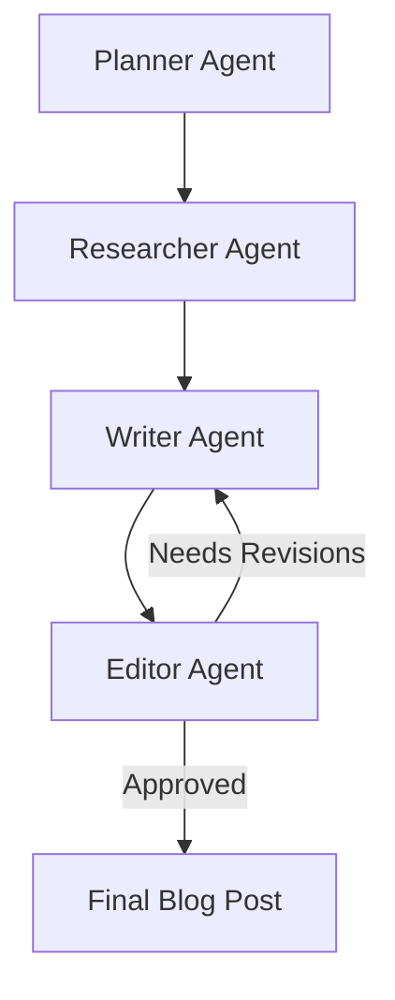

# 🤖 Multi-Agent Blog Writing System

A sophisticated blog writing system powered by AI, using multiple specialized agents to create high-quality content for **Credilinq.ai**, a leading fintech company. The system leverages Google Gemini or OpenAI models and RAG for company-specific knowledge.

## 🏗️ System Architecture

This project has been fully refactored from a simple agent to a **multi-agent system** with the following features:

### 🎭 The 4 Specialized Agents

1. **🎯 Planner Agent**: Creates detailed outlines for blog posts
2. **🔍 Researcher Agent**: Uses RAG to find relevant information in the company knowledge base
3. **✍️ Writer Agent**: Drafts content based on the outline and research
4. **🔍 Editor Agent**: Reviews quality and can request revisions (review loop)

### 🛠️ Tech Stack

- **LLM**: Google Gemini 1.5 Pro or OpenAI GPT-3.5/4o (configurable)
- **Orchestration**: LangGraph + LangChain
- **RAG**: FAISS Vector Store with OpenAI or Google Embeddings
- **API**: FastAPI for deployment on Vercel
- **Vector Database**: Local FAISS

## 🚀 Setup & Installation

### 1. Install Dependencies

```bash
pip install -r requirements.txt
```

### 2. Configure Environment Variables

```bash
# Copy the template
cp env_template.txt .env

# Edit .env with your OpenAI or Google AI API Key
OPENAI_API_KEY="your-openai-api-key-here"
# or
GOOGLE_API_KEY="your-google-ai-api-key-here"
```

### 3. Prepare the RAG Knowledge Base

```bash
# Add .txt documents to the knowledge_base/ directory
# Example: company policies, product docs, fintech articles, Credilinq.ai case studies

# Build the FAISS vector index
python setup_retriever.py
```

## 🎯 Using the System

### Local Development Mode

```bash
# Test the agent directly
python agent.py

# Run the FastAPI server
uvicorn main:api --reload
```

### API Endpoints

- **POST `/generate-blog`**: Generates a blog post using the multi-agent workflow
- **GET `/health`**: System and agent status
- **GET `/workflow-status`**: RAG system and configuration status

### Example Request

```python
import requests

response = requests.post("http://localhost:8000/generate-blog", json={
    "title": "How Embedded Lending is Transforming B2B Payments",
    "company_context": "Credilinq.ai is a fintech leader in embedded lending and B2B credit solutions across Southeast Asia."
})

print(response.json()["final_post"])
```

## 🔄 Multi-Agent Workflow Diagram



1. **Planner**: Analyzes the title and company context, creates a structured outline
2. **Researcher**: For each section, finds relevant information in the knowledge base using RAG
3. **Writer**: Combines outline + research + company context to draft the post
4. **Editor**: Reviews for quality and alignment. Can approve or request specific revisions

## 📁 Project Structure

```
credilinq-agent/
├── agent.py                 # Main multi-agent system
├── main.py                  # FastAPI API
├── setup_retriever.py       # Script to build RAG index
├── requirements.txt         # Project dependencies
├── vercel.json              # Deployment config
├── env_template.txt         # Environment variable template
├── knowledge_base/          # Company knowledge documents
│   ├── sample_content.txt
│   └── business_insights.txt
├── faiss_index/             # FAISS vector index (generated)
└── README.md                # This documentation
```

## ⚙️ Advanced Features

### 🔄 Intelligent Review Loop
The Editor Agent can request specific revisions from the Writer Agent, creating a continuous improvement loop until the content meets Credilinq.ai's quality standards.

### 🧠 Custom RAG
The system uses a local knowledge base that you can customize by adding `.txt` documents to `knowledge_base/`. The Researcher Agent finds relevant information for each blog section.

### 📊 Workflow Monitoring
The API provides detailed information about each agent's process, including the number of sections, whether revisions occurred, and the final status.

## 🚀 Deployment on Vercel

```bash
# Install Vercel CLI
npm i -g vercel

# Deploy
vercel

# Make sure to set your API keys in Vercel's environment variables
```

## 🔧 Troubleshooting

### Error: "Could not load FAISS index"
- Run `python setup_retriever.py` to create the index
- Make sure you have documents in `knowledge_base/`

### Error: "OPENAI_API_KEY not found"
- Ensure the `.env` file exists and contains your API key
- Get your API key from [OpenAI](https://platform.openai.com/api-keys)

### RAG research is empty
- Add more relevant `.txt` documents to `knowledge_base/`
- Rebuild the index with `python setup_retriever.py`

---

**This system is ready to generate high-quality, company-specific blogs for Credilinq.ai using the power of multi-agent collaboration! 🚀** 