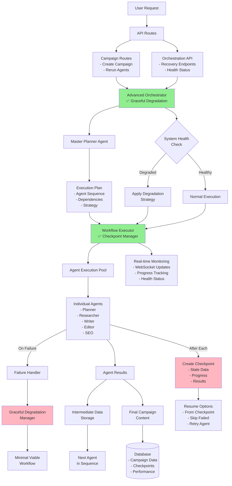

# 🔄 Optimized Workflow Information Flow with Recovery Systems

## 📊 Complete Information Flow Architecture



## 🎯 Detailed Information Flow Stages

### **Stage 1: Request Initiation**
```
User Request → API Endpoint → Campaign Route
    ↓
    Campaign Data:
    - campaign_id
    - company_context
    - target_audience
    - content_objective
    - priority
```

### **Stage 2: Orchestration Setup with Recovery**
```
Advanced Orchestrator (with Graceful Degradation)
    ↓
    1. System Health Assessment
       - Check service availability
       - Assess degradation level
       - Determine if can proceed
    
    2. Master Planner Creates Execution Plan
       - Analyze dependencies
       - Determine execution strategy
       - Set agent sequence
    
    3. Apply Degradation if Needed
       - Reduce to minimal viable workflow
       - Notify user of limitations
       - Adjust quality expectations
```

### **Stage 3: Workflow Execution with Checkpoints**
```
Workflow Executor (with Checkpoint Manager)
    ↓
    For Each Agent in Sequence:
        1. Pre-execution
           - Check dependencies met
           - Verify agent available
           - Register with degradation manager
        
        2. Agent Execution
           - Prepare input data
           - Execute agent logic
           - Capture results
        
        3. Post-execution
           - Create automatic checkpoint ✅
           - Store intermediate data
           - Update progress tracking
           - Report to monitoring
        
        4. Failure Handling (if needed)
           - Report to degradation manager
           - Determine recovery strategy
           - Create error checkpoint
           - Attempt fallback options
```

### **Stage 4: Data Flow Between Agents**
```
Agent A (e.g., Researcher)
    ↓
    Output: {
        "research_data": {...},
        "sources": [...],
        "insights": {...}
    }
    ↓
    Checkpoint Created: checkpoint_123
    ↓
    Intermediate Data Storage
    ↓
    Agent B (e.g., Writer)
    Input: {
        "research_data": from Agent A,
        "campaign_context": original,
        "previous_results": accumulated
    }
```

### **Stage 5: Recovery Points and Options**
```
At Any Checkpoint:
    ├── Can Resume From Here
    ├── Can Skip Failed Agent
    ├── Can Use Degraded Workflow
    └── Can Retry with Different Parameters
    
Recovery Data Structure:
{
    "checkpoint_id": "abc123",
    "workflow_id": "campaign_xyz",
    "phase_name": "agent_writer_completed",
    "state_data": {
        "completed_agents": ["planner", "researcher"],
        "failed_agents": [],
        "intermediate_data": {...},
        "current_progress": 40
    },
    "resume_instructions": "Continue from writer output",
    "available_actions": ["continue", "retry", "skip"]
}
```

## 📈 Information Flow Optimizations

### **1. Parallel Execution Flow**
```
When strategy = "parallel":
    
    Planner Agent
        ↓
    ┌─────────────────┬──────────────────┐
    ↓                 ↓                  ↓
Researcher A    Researcher B      Researcher C
    ↓                 ↓                  ↓
    └─────────────────┴──────────────────┘
                      ↓
              Result Aggregation
                      ↓
                Writer Agent
```

### **2. Degraded Mode Flow**
```
Normal Flow (All Services Available):
Planner → Researcher → Writer → Editor → SEO → Distribution

Degraded Flow (Some Services Failed):
Planner → Basic Research → Writer → Basic QA
         (Researcher failed)  (Editor & SEO unavailable)
```

### **3. Checkpoint Recovery Flow**
```
Original Execution:
Start → Planner ✅ → Researcher ✅ → Writer ❌ (failed)
                                      ↓
                                 Checkpoint_002
                                      ↓
Resume from Checkpoint_002:
Load State → Retry Writer → Editor → Complete
```

## 🔧 Key Information Channels

### **1. WebSocket Real-time Updates**
```javascript
{
    "type": "agent_progress",
    "campaign_id": "camp_123",
    "current_agent": "researcher",
    "progress": 35,
    "checkpoint_created": true,
    "degradation_level": "none",
    "message": "Research phase in progress"
}
```

### **2. Database Persistence**
```sql
-- Checkpoint Storage
checkpoints/
├── workflow_id/
│   ├── checkpoint_001.json.gz
│   ├── checkpoint_002.json.gz
│   └── metadata.json

-- Performance Tracking
AgentPerformance
├── execution_id
├── agent_name
├── execution_time
├── success_status
└── checkpoint_id

-- Degradation Events
ServiceHealth
├── service_name
├── health_status
├── failure_count
├── last_check
└── recovery_time
```

### **3. API Response Structure**
```json
{
    "success": true,
    "workflow_execution_id": "exec_123",
    "status": "completed",
    "agents_executed": ["planner", "researcher", "writer", "editor"],
    "checkpoints_created": 4,
    "recovery_enabled": true,
    "degradation_events": 0,
    "total_duration": 45.2,
    "quality_score": 0.92,
    "intermediate_results": {
        "planner": {...},
        "researcher": {...},
        "writer": {...},
        "editor": {...}
    }
}
```

## 🚀 Critical Information Paths

### **Fast Path (No Issues)**
```
Request → Orchestrator → Executor → Agents → Results
         2s            1s         30s      1s
         
Total: ~34 seconds for complete workflow
```

### **Recovery Path (With Checkpoint)**
```
Request → Load Checkpoint → Resume Agent → Continue → Results
         2s              3s            15s         10s
         
Total: ~30 seconds (saves time by skipping completed work)
```

### **Degraded Path (Service Issues)**
```
Request → Health Check → Degraded Plan → Minimal Agents → Results
         2s           2s             1s              20s
         
Total: ~25 seconds (faster but reduced quality)
```

## 🔍 Information Access Points

### **1. Frontend Access**
- Real-time progress via WebSocket
- Checkpoint list via API
- Recovery options via UI
- Health status dashboard

### **2. API Endpoints**
- `GET /workflows/{id}/checkpoints` - List checkpoints
- `POST /workflows/{id}/checkpoints/manual` - Create checkpoint
- `POST /workflows/resume/{checkpoint_id}` - Resume workflow
- `GET /system/health-status` - System health
- `GET /system/degradation-status` - Degradation info

### **3. Direct Database Access**
- Checkpoint files in filesystem
- Performance metrics in AgentPerformance table
- Service health in monitoring tables
- Campaign results in campaign tables

## 📊 Performance Metrics Flow

```
Each Agent Execution:
    ├── Start Time Recorded
    ├── Resource Usage Tracked
    ├── Execution Time Measured
    ├── Quality Score Calculated
    ├── Checkpoint Size Recorded
    └── All Metrics → Database → Analytics Dashboard
```

## 🎯 Summary: Complete Information Flow

1. **Request** enters through API
2. **Orchestrator** assesses system health
3. **Master Planner** creates execution plan
4. **Degradation Manager** adjusts if needed
5. **Workflow Executor** manages execution
6. **Agents** process in sequence/parallel
7. **Checkpoints** created after each agent
8. **Recovery** available at any checkpoint
9. **Results** aggregated and stored
10. **Monitoring** provides real-time updates

**The system is now resilient, observable, and recoverable at every stage!**